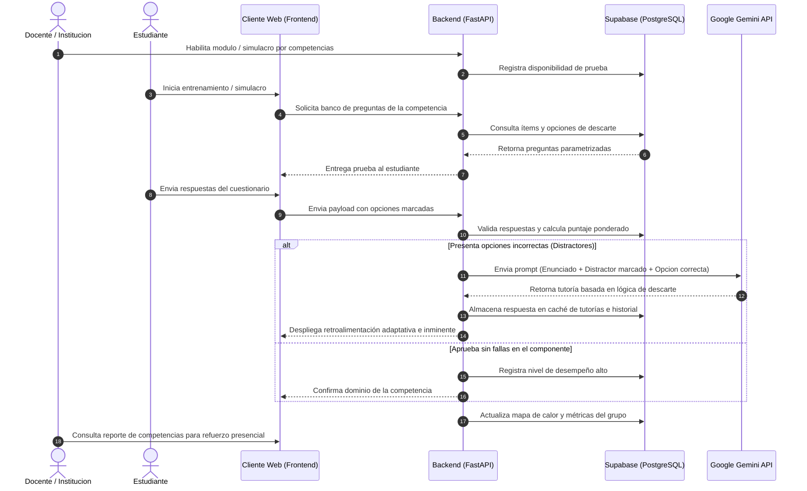

# Lógica y Procesos Principales del Proyecto

## 1. Propósito e Intención General

La Plataforma de Entrenamiento Adaptativo y Diagnóstico por Competencias se concibe como un entorno digital especializado en la preparación autónoma e institucional para pruebas de estado en la educación secundaria. A diferencia de los gestores de aprendizaje tradicionales o repositorios estáticos de talleres, la plataforma no busca asignar calificaciones sumativas sobre temas escolares individuales ni entregar respuestas automatizadas para tareas. Su valor central radica en actuar como un motor de diagnóstico continuo y entrenamiento adaptativo basado estrictamente en la matriz de competencias del ICFES, abarcando Lectura Crítica, Razonamiento Cuantitativo, Competencias Ciudadanas, Ciencias Naturales e Inglés.

El enfoque pedagógico se centra en el entrenamiento mediante la lógica de descarte. El sistema evalúa la elección del estudiante no solo como correcta o incorrecta, sino analizando los distractores seleccionados para enseñarle la estructura del razonamiento a través de la API de IA. De este modo, la herramienta no resuelve el ejercicio por el usuario, sino que desarma la pregunta para exponer por qué una opción parece válida y cómo identificar las pistas clave del enunciado, transformando la revisión del error en una sesión de entrenamiento estratégico.

Esta dinámica fomenta la autonomía del estudiante, quien puede medir su desempeño por niveles de avance, al tiempo que provee al cuerpo docente y directivo mapas de calor sobre las competencias institucionales en las que los grupos presentan mayor índice de falla. En lugar de recargar al profesor con la calificación manual de talleres o la creación masiva de guías, la plataforma sirve como un termómetro previo a la prueba presencial, guiando las intervenciones de refuerzo del docente en el aula a partir de métricas concretas y consolidadas.

---

## 2. Flujo Principal de Procesos

El ciclo operativo del sistema se estructura en un flujo continuo de diagnóstico, evaluación y refuerzo personalizado que conecta las acciones del estudiante y el cuerpo docente con la arquitectura técnica backend y la IA. En lugar de depender de la creación semanal de guías manuales, el proceso inicia cuando la institución o el equipo docente habilita un módulo de entrenamiento o simulacro estructurado según las matrices de evidencia del ICFES.

El estudiante accede a la interfaz e inicia la resolución de la prueba de forma autónoma. Al enviar sus respuestas, el servidor FastAPI procesa la prueba de manera inmediata contra el banco de datos en Supabase, calculando el nivel de desempeño obtenido e identificando las opciones incorrectas. En caso de detectar fallas en componentes clave, el backend no se limita a marcar el error; envía un prompt parametrizado a la API de Google Gemini enviando el enunciado, la opción correcta y el distractor específico seleccionado por el usuario. La IA genera una tutoría corta enfocada en la lógica de descarte, explicando el patrón de la trampa en la opción marcada y la técnica para identificar la respuesta válida.

Finalmente, la tutoría generada se almacena en la caché de la base de datos para optimizar futuras consultas sobre el mismo ítem y se despliega en pantalla al estudiante. De forma paralela y asíncrona, el backend actualiza el historial del usuario y alimenta el mapa de calor institucional del grado o sección. Este registro consolidado permite a los docentes y directivos consultar analíticas precisas sobre los vacíos grupales antes de la prueba presencial, cerrando el ciclo con intervenciones focalizadas en el aula de clase.

---

## 3. Módulos y Funciones del Sistema

### Panel de Administración del Docente
Funciona como el centro de control para el profesor. Desde allí se gestionan los diferentes salones de forma independiente, lo cual permite adaptar las actividades al ritmo real de cada grupo, por ejemplo, separando la intensidad o avance de 6-1 frente a 6-2. 

El docente elige los temas trabajados en el aula presencial y solicita al sistema una propuesta de taller. Una vez generadas las preguntas, las revisa, realiza los ajustes necesarios y las activa para sus alumnos. Posteriormente, consulta un mapa de rendimiento grupal que le muestra cuáles temas causaron mayor dificultad.

### Interfaz del Estudiante
Es el espacio donde el alumno resuelve las actividades asignadas a su curso. Al terminar un ejercicio, si comete un fallo, la pantalla no se limita a marcar la respuesta en rojo; automáticamente despliega una tutoría breve que le explica el procedimiento correcto paso a paso, usando un lenguaje adecuado para su grado académico.

### Servicio de Backend e Integración con IA
El servidor recibe las entregas de los estudiantes, las compara contra las respuestas correctas y determina si es necesario solicitar apoyo a la API de Google Gemini. 

Cuando detecta vacíos en las respuestas, construye una consulta detallada para la IA exigiendo que las explicaciones se mantengan estrictamente dentro del nivel escolar correspondiente. Para evitar un consumo excesivo de la API y agilizar la respuesta, el sistema guarda en memoria las tutorías generadas para errores comunes y las reutiliza si otros compañeros del mismo salón cometen la misma falla.

---

## 4. Adaptación al Entorno Escolar Real

Las dinámicas de un colegio varían constantemente por festivos, actividades o ritmos de aprendizaje distintos entre salones. La plataforma resuelve este problema permitiendo publicar o desfasar las fechas de los talleres por cada sección sin alterar el historial general del grado.

Frente a la estabilidad de las conexiones a internet en las instituciones, la aplicación intercambia datos mediante formatos livianos en JSON. En caso de experimentar caídas momentáneas en la red, la interfaz almacena las respuestas del usuario de forma local hasta que el servidor confirme la recepción completa del taller.
