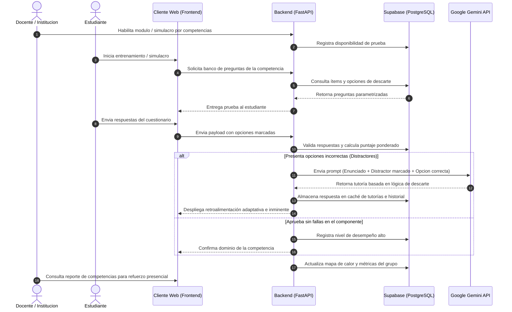

# Lógica y Procesos Principales del Proyecto

## 1. Propósito e Intención General

La Plataforma de Entrenamiento Adaptativo y Diagnóstico por Competencias se concibe como un entorno digital especializado en la preparación autónoma e institucional para pruebas de estado en la educación secundaria. A diferencia de los gestores de aprendizaje tradicionales o repositorios estáticos de talleres, la plataforma no busca asignar calificaciones sumativas sobre temas escolares individuales ni entregar respuestas automatizadas para tareas. Su valor central radica en actuar como un motor de diagnóstico continuo y entrenamiento adaptativo basado estrictamente en la matriz de competencias del ICFES, abarcando Lectura Crítica, Razonamiento Cuantitativo, Competencias Ciudadanas, Ciencias Naturales e Inglés.

El enfoque pedagógico se centra en el entrenamiento mediante la lógica de descarte. El sistema evalúa la elección del estudiante no solo como correcta o incorrecta, sino analizando los distractores seleccionados para enseñarle la estructura del razonamiento a través de la API de IA. De este modo, la herramienta no resuelve el ejercicio por el usuario, sino que desarma la pregunta para exponer por qué una opción parece válida y cómo identificar las pistas clave del enunciado, transformando la revisión del error en una sesión de entrenamiento estratégico.

Esta dinámica fomenta la autonomía del estudiante, quien puede medir su desempeño por niveles de avance, al tiempo que provee al cuerpo docente y directivo mapas de calor sobre las competencias institucionales en las que los grupos presentan mayor índice de falla. En lugar de recargar al profesor con la calificación manual de talleres o la creación masiva de guías, la plataforma sirve como un termómetro previo a la prueba presencial, guiando las intervenciones de refuerzo del docente en el aula a partir de métricas concretas y consolidadas.

---

## 2. Flujo Principal de Procesos

El ciclo operativo del sistema se estructura en un flujo continuo de diagnóstico, evaluación y refuerzo personalizado que conecta las acciones del estudiante y el cuerpo docente con la arquitectura técnica backend y la IA. En lugar de depender de la creación semanal de guías manuales, el proceso inicia cuando la institución o el equipo docente habilita un módulo de entrenamiento o simulacro estructurado según las matrices de evidencia del ICFES.

El estudiante accede a la interfaz e inicia la resolución de la prueba de forma autónoma. Al enviar sus respuestas, el servidor FastAPI procesa la prueba de manera inmediata contra el banco de datos en Supabase, calculando el nivel de desempeño obtenido e identificando las opciones incorrectas. En caso de detectar fallas en componentes clave, el backend no se limita a marcar el error; envía un prompt parametrizado a la API de Google Gemini enviando el enunciado, la opción correcta y el distractor específico seleccionado por el usuario. La IA genera una tutoría corta enfocada en la lógica de descarte, explicando el patrón de la trampa en la opción marcada y la técnica para identificar la respuesta válida.

Finalmente, la tutoría generada se almacena en la caché de la base de datos para optimizar futuras consultas sobre el mismo ítem y se despliega en pantalla al estudiante. De forma paralela y asíncrona, el backend actualiza el historial del usuario y alimenta el mapa de calor institucional del grado o sección. Este registro consolidado permite a los docentes y directivos consultar analíticas precisas sobre los vacíos grupales antes de la prueba presencial, cerrando el ciclo con intervenciones focalizadas en el aula de clase.

---

## 3. Módulos y Funciones del Sistema

### Panel de Gestión Institucional y Docente
Funciona como el centro de monitoreo analítico para docentes y directivos. A diferencia de un entorno convencional de calificación de tareas, este módulo permite consultar el desempeño de los estudiantes agrupado por competencias y componentes del ICFES en lugar de notas tradicionales. El docente puede revisar mapas de calor institucionales que identifican las brechas conceptuales del grupo, gestionar la activación de simulacros globales o habilitar bancos de entrenamiento específicos, y acceder a reportes consolidados que orientan la planeación de refuerzos presenciales en el aula de clase.

### Interfaz del Estudiante y Modos de Evaluación
Es el entorno interactivo donde el alumno gestiona su preparación de forma autónoma o institucional. Para garantizar una preparación integral, la interfaz se divide en dos secciones operativas principales:

* **Modo Entrenamiento Libre:** Espacio de práctica flexible donde el estudiante selecciona la competencia específica que desea fortalecer (como Lectura Crítica o Razonamiento Cuantitativo). Durante este flujo, la IA de Google Gemini interviene de manera inminente ante cada error, desplegando una tutoría corta orientada a la lógica de descarte sobre la opción marcada y sugiriendo recursos complementarios para reforzar la falencia.
* **Modo Simulacro Real:** Módulo de evaluación controlada que mimetiza las condiciones del examen presencial mediante pruebas temporizadas y cronometradas en pantalla. Durante la ejecución de la prueba, la retroalimentación de la IA se deshabilita para mantener la concentración del usuario. Al finalizar la entrega, el sistema procesa el resultado global, emite un puntaje proyectado y entrega un informe diagnóstico detallado con la revisión adaptativa de las preguntas falladas.

### Servicio Backend e Integración con IA
El servidor en FastAPI actúa como el núcleo lógico del sistema, encargado de validar las entregas, procesar las matrices de ponderación y gestionar las comunicaciones con la base de datos y los servicios externos. Cuando el motor detecta elecciones incorrectas en las pruebas, construye un prompt altamente parametrizado hacia la API de Google Gemini, enviando el enunciado, la respuesta correcta y el distractor específico marcado por el usuario para exigir una explicación enfocada exclusivamente en el descarte de la trampa. Para optimizar el rendimiento de la red y reducir costos operativos, el backend almacena las tutorías generadas en una tabla de caché en Supabase, permitiendo reutilizar explicaciones previas ante errores idénticos cometidos por otros usuarios.

---

## 4. Adaptación al Entorno Escolar Real y Gestión de Limitaciones

La implementación de plataformas tecnológicas en instituciones de educación básica y media enfrenta desafíos operativos concretos, como la inestabilidad en las conexiones a Internet, los intentos de consulta externa durante las evaluaciones y los costos de latencia en servicios de inteligencia artificial. La arquitectura del sistema integra decisiones de diseño orientadas a mitigar estos escenarios sin comprometer la experiencia de usuario ni la integridad del proceso formativo.

Frente a las fluctuaciones de red en las aulas, la aplicación utiliza intercambios de datos en formatos livianos mediante solicitudes asíncronas en JSON. Durante la ejecución de un simulacro o entrenamiento, las respuestas marcadas por el estudiante se conservan temporalmente en el almacenamiento local del navegador. En caso de caídas momentáneas en la conectividad, el cliente web reintenta el envío de fondo tan pronto como la red se restablece, previniendo la pérdida de progreso y sentando las bases para una futura integración bajo el estándar PWA.

Respecto al control de la integridad en la prueba, la plataforma reconoce la naturaleza de la evaluación formativa y la autonomía del estudiante en su preparación para exámenes estatales. Para minimizar la copia directa o la consulta en herramientas externas durante los simulacros, el backend implementa mecanismos de aleatorización de preguntas u opciones desde el banco de datos, limites de tiempo por componente y restricciones en el cliente web sobre la selección o copiado de enunciados. Asimismo, el uso de la API de Google Gemini se optimiza mediante una estrategia de caché en Supabase, la cual evita llamadas redundantes al servidor de IA para errores comunes ya procesados, reduciendo los tiempos de respuesta a milisegundos y garantizando la sostenibilidad operativa del sistema.
