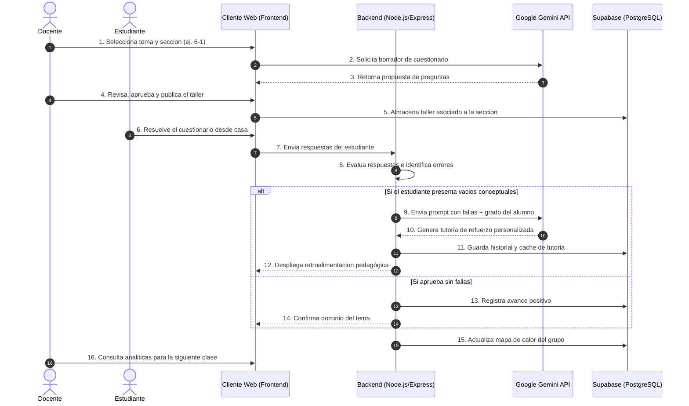

# Lógica del Proyecto y Procesos Principales

## 1. Propósito e Intención General
El Sistema de Aprendizaje en Línea con IA Adaptativa se plantea como una herramienta de apoyo y refuerzo para estudiantes de educación básica y media, abarcando desde grado sexto hasta once. 

Para entender su enfoque, es importante diferenciarlo de plataformas institucionales como Moodle. Mientras que Moodle administra contenidos académicos y registra las notas oficiales, este proyecto funciona como un entorno de tutoría formativa. Su meta no es asignar un número o castigar el error, sino identificar en tiempo real en qué parte del tema se confundió el estudiante y entregarle una explicación inmediata para corregir esa falla.

La plataforma trabaja a la par con la clase presencial. El profesor dicta su tema en el salón, habilita los talleres de refuerzo en la aplicación y revisa los reportes de desempeño para saber qué puntos debe volver a explicar en el tablero la siguiente semana.

---

## 2. Flujo Principal de Procesos (El Ciclo de Aprendizaje)

---

## 3. Módulos y Funciones del Sistema

### Panel de Administración del Docente
Funciona como el centro de control para el profesor. Desde allí se gestionan los diferentes salones de forma independiente, lo cual permite adaptar las actividades al ritmo real de cada grupo, por ejemplo, separando la intensidad o avance de 6-1 frente a 6-2. 

El docente elige los temas trabajados en el aula presencial y solicita al sistema una propuesta de taller. Una vez generadas las preguntas, las revisa, realiza los ajustes necesarios y las activa para sus alumnos. Posteriormente, consulta un mapa de rendimiento grupal que le muestra cuáles temas causaron mayor dificultad.

### Interfaz del Estudiante
Es el espacio donde el alumno resuelve las actividades asignadas a su curso. Al terminar un ejercicio, si comete un fallo, la pantalla no se limita a marcar la respuesta en rojo; automáticamente despliega una tutoría breve que le explica el procedimiento correcto paso a paso, usando un lenguaje adecuado para su grado académico.

### Servicio de Backend e Integración con IA
El servidor recibe las entregas de los estudiantes, las compara contra las respuestas correctas y determina si es necesario solicitar apoyo a la API de Google Gemini. 

Cuando detecta vacíos en las respuestas, construye una consulta detallada para la IA exigiendo que las explicaciones se mantengan estrictamente dentro del nivel escolar correspondiente. Para evitar un consumo excesivo de la API y agilizar la respuesta, el sistema guarda en memoria las tutorías generadas para errores comunes y las reutiliza si otros compañeros del mismo salón cometen la misma falla.

---

## 4. Adaptación al Entorno Escolar Real

Las dinámicas de un colegio varían constantemente por festivos, actividades o ritmos de aprendizaje distintos entre salones. La plataforma resuelve este problema permitiendo publicar o desfasar las fechas de los talleres por cada sección sin alterar el historial general del grado.

Frente a la estabilidad de las conexiones a internet en las instituciones, la aplicación intercambia datos mediante formatos livianos en JSON. En caso de experimentar caídas momentáneas en la red, la interfaz almacena las respuestas del usuario de forma local hasta que el servidor confirme la recepción completa del taller.
