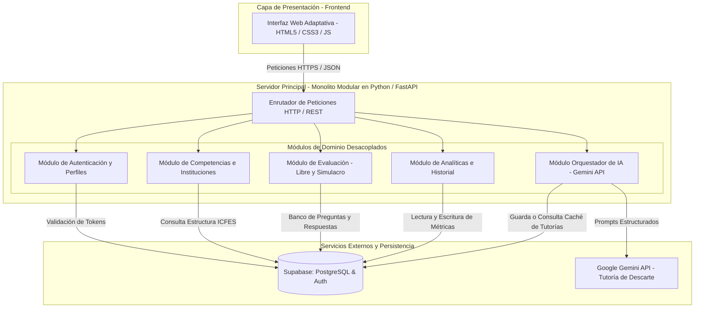

# Descripción de la Arquitectura

## 1. Estilo Arquitectónico

Para el diseño y construcción de la plataforma se seleccionó el estilo arquitectónico de **Monolito Modular**. Esta decisión responde a la necesidad de mantener un sistema altamente mantenible, desacoplado y fácil de desplegar dentro de un único repositorio de código.

A diferencia de un monolito convencional de capas planas, la aplicación organiza su lógica de negocio en módulos funcionales independientes centrados en el dominio del problema. Cada módulo gestiona sus propias reglas de negocio y expone interfaces claras para comunicarse con el resto del sistema. De esta manera, componentes como el motor de evaluación por competencias, el orquestador de IA o el generador de analíticas institucionales operan de forma aislada, facilitando el mantenimiento y la evolución del código por parte del equipo de desarrollo.

---

## 2. Diagrama de Arquitectura del Sistema

La arquitectura de la solución se organiza en tres capas principales: la capa de presentación en el cliente web, el servidor de aplicación monolítico modular desarrollado en Python con FastAPI, y la capa de persistencia y servicios externos respaldada por Supabase y la API de Google Gemini.

---

## 3. Descripción de los Módulos de Dominio

### Módulo de Autenticación y Perfiles
Gestiona la identidad de los usuarios y el control de acceso basado en roles, diferenciando los permisos entre el perfil de Estudiante y el perfil de Gestión Institucional o Docente. Se integra directamente con Supabase Auth para la administración de sesiones seguras mediante tokens JWT, garantizando que cada petición al servidor mantenga el contexto y la trazabilidad del usuario.

### Módulo de Competencias e Instituciones
Administra la estructura del conocimiento basada en el marco oficial del ICFES. En lugar de gestionar materias escolares estáticas, este módulo organiza los bancos de preguntas por competencias (como Lectura Crítica, Razonamiento Cuantitativo o Competencias Ciudadanas) y componentes específicos. Asimismo, permite la vinculación institucional para agrupar las métricas de los estudiantes según sus respectivos colegios o grupos de preparación.

### Módulo de Evaluación
Se encarga de la lógica operativa de las pruebas, gestionando tanto la modalidad de Entrenamiento Libre como los Simulacros Reales. Administra la aleatorización de preguntas, el control de tiempos mediante cronómetro, el registro de respuestas seleccionadas y la ponderación de puntajes. Este módulo determina si la entrega requiere una intervención inmediata de la IA o si consolidará un informe diagnóstico al finalizar el intento.

### Módulo Orquestador de IA
Actúa como la capa inteligente del sistema construida en FastAPI. Cuando el módulo de evaluación registra un fallo en la respuesta de un estudiante, el orquestador empaqueta el enunciado, la opción correcta y el distractor específico seleccionado para enviar un prompt estructurado a la API de Google Gemini. Adicionalmente, administra la estrategia de caché en la base de datos para almacenar y reutilizar explicaciones previas ante errores idénticos, reduciendo la latencia y el consumo del servicio externo.

### Módulo de Analíticas e Historial
Procesa las interacciones y resultados acumulados para construir diagnósticos globales e individuales. Para el estudiante, genera históricos de evolución y nivel de desempeño proyectado por competencia. Para las instituciones y docentes, consolida mapas de calor que exponen las brechas conceptuales del grupo, ofreciendo insumos precisos para guiar los refuerzos en las clases presenciales.

---

## 4. Componentes Tecnológicos e Infraestructura

* **Frontend:** Cliente web interactivo basado en HTML5, CSS3 y JavaScript, optimizado para bajo consumo de datos en redes escolares.
* **Backend:** Servidor en **Python** estructurado con el framework **FastAPI**, organizado bajo el patrón de carpetas por módulo (`src/modules/...`).
* **Base de Datos y Persistencia:** Supabase (PostgreSQL relacional) con esquemas definidos para el almacenamiento de usuarios, secciones, cuestionarios, intentos y respuestas de caché.
* **Proveedor de IA:** Google Gemini API (modelo Gemini 1.5 Flash integrado mediante la librería oficial `google-genai` en Python), seleccionado por su baja latencia y alta precisión pedagógica.
