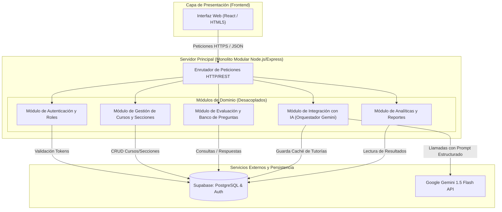

# Descripción de la Arquitectura de Software

## 1. Estilo Arquitectónico: Monolito Modular

Para el diseño y construcción de la plataforma se seleccionó el estilo arquitectónico de **Monolito Modular**. Esta decisión responde a la necesidad de mantener un sistema altamente mantenible, desacoplado y fácil de desplegar, evitando la sobreingeniería y complejidad operativa que representan los microservicios en etapas tempranas.

A diferencia de un monolito convencional de capas planas, la aplicación organiza su lógica de negocio en **módulos funcionales independientes** centrados en el dominio del problema. Cada módulo gestiona su propia lógica y expone interfaces claras para comunicarse con el resto del sistema.

---

## 2. Diagrama de Arquitectura del Sistema

---

## 3. Descripción de los Módulos de Dominio

### Módulo de Autenticación y Control de Acceso
Gestiona la identidad de los usuarios, diferenciando los permisos y vistas entre el rol de **Docente** y el rol de **Estudiante**. Se integra directamente con el servicio de seguridad de Supabase Auth para el manejo de sesiones mediante tokens seguros.

### Módulo de Cursos y Secciones
Resuelve la variabilidad del entorno escolar permitiendo la administración independiente de aulas. Permite la clonación de talleres entre secciones y el control de disponibilidad de las actividades según el avance real de cada grupo.

### Módulo de Evaluación y Cuestionarios
Encargado de la estructura de las evaluaciones, el registro de opciones de respuesta y la calificación automática en el servidor al momento en que un alumno envía su intento.

### Módulo Adaptativo de IA (Orquestador de Prompts)
Actúa como la capa de inteligencia del sistema. Cuando el módulo de evaluación detecta fallas conceptuales en la entrega de un estudiante, este módulo empaqueta el contexto académico (grado, tema y tipo de error) y consulta la API de Google Gemini para obtener una tutoría explicativa. Implementa un mecanismo de almacenamiento en caché en la base de datos para reutilizar explicaciones frente a errores idénticos.

### Módulo de Analíticas
Agrupa y procesa las calificaciones e intentos de los estudiantes para construir visualizaciones consolidadas ("mapas de calor") que sirven como insumo diagnóstico para el docente en su aula presencial.

---

## 4. Componentes Tecnológicos e Infraestructura

* **Frontend:** Cliente web receptivo e interactivo, optimizado para bajo consumo de datos en redes escolares.
* **Backend:** Entorno de ejecución Node.js con Express, estructurado bajo el patrón de carpetas por módulo (`src/modules/...`).
* **Base de Datos y Persistencia:** Supabase (PostgreSQL relacional) con esquemas definidos para el almacenamiento de usuarios, secciones, cuestionarios, intentos y respuestas de caché.
* **Proveedor de IA:** Google Gemini API (modelo Gemini 1.5 Flash) seleccionado por su baja latencia y alta precisión en la generación de texto pedagógico.
